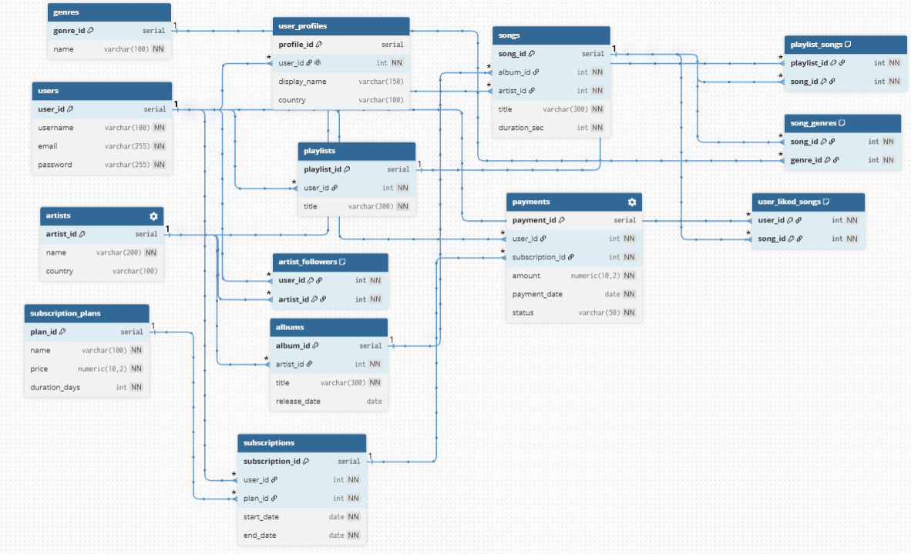

## 4 ASSIGNMENT
## Опис бази даних
---
Модель музичного стрімінгового сервісу на зразок Spotify, яка містить 14 таблиць і використовує зв'язки 1:1, 1:Many та Many:Many.
---

---
## Зв'язки між таблицями
| Тип | Таблиці |
|-----|---------|
| 1:1 | `users` → `user_profiles` |
| 1:Many | `artists` → `albums` |
| 1:Many | `albums` → `songs` |
| 1:Many | `artists` → `songs` |
| 1:Many | `users` → `playlists` |
| 1:Many | `users` → `subscriptions` |
| 1:Many | `subscription_plans` → `subscriptions` |
| 1:Many | `subscriptions` → `payments` |
| Many:Many | `playlists` ↔ `songs` через `playlist_songs` |
| Many:Many | `songs` ↔ `genres` через `song_genres` |
| Many:Many | `users` ↔ `songs` через `user_liked_songs` |
| Many:Many | `users` ↔ `artists` через `artist_followers` |

---
## Оптимізація запитів

### Запит
Запит знаходить топ-10 артистів за кількістю лайків їх пісень, 
використовуючи CTE `liked_counts` для підрахунку лайків, 
після чого джоінить результат з таблицями `artists` та `albums`.
```sql
explain analyze
with liked_counts as (
    select s.artist_id, count(*) as total_likes
    from user_liked_songs ul
    join songs s on s.song_id = ul.song_id
    group by s.artist_id
)
select a.name, al.title, lc.total_likes
from liked_counts lc
join artists a on a.artist_id = lc.artist_id
join albums al on al.artist_id = a.artist_id
order by lc.total_likes desc
limit 10;
```
### Індекси
```sql
create index idx_songs_artist_id on songs(artist_id);
create index idx_songs_song_id on songs(song_id);
create index idx_ul_song_id on user_liked_songs(song_id);
create index idx_albums_artist_id on albums(artist_id);
```

### Порівняння

| | До індексів | Після індексів |
|--|-------------|----------------|
| Execution Time | 603 ms | 189 ms |
| Тип на `songs` | Seq Scan | Index Scan |
| Тип на `user_liked_songs` | Seq Scan | Index Only Scan |
| Join | Hash Join | Merge Join |

### Висновок
---
Після створення індексів запит виконується у **3 рази швидше**. 
PostgreSQL замість повного перебору таблиць використовує індекси,
а Hash Join замінився на Merge Join.
---
## Ролі та права доступу

| Роль | Права |
|------|-------|
| `music_admin` | повний доступ до всіх таблиць |
| `music_artist` | читання всього, додавання та редагування пісень і альбомів |
| `music_listener` | читання всього, лайки, підписки на артистів, оформлення підписки та платежів |
---
```sql
create role music_admin login password 'admin123';
create role music_artist login password 'artist123';
create role music_listener login password 'listener123';

-- адмін: повний доступ
grant all privileges on all tables in schema public to music_admin;

-- артист: може додавати пісні та альбоми, читати все
grant select on all tables in schema public to music_artist;
grant insert, update on songs to music_artist;
grant insert, update on albums to music_artist;

-- слухач: тільки читання + лайки
grant select on all tables in schema public to music_listener;
grant insert, delete on user_liked_songs to music_listener;
grant insert, delete on artist_followers to music_listener;

grant insert on payments to music_listener;
grant insert on subscriptions to music_listener;
grant select on subscription_plans to music_listener;
```
---
## View

`top_artists` показує список артистів і кількість лайків їх пісень, відсортований за популярністю.

```sql
create or replace view top_artists as
select a.name, count(ul.song_id) as total_likes
from artists a
join songs s on s.artist_id = a.artist_id
join user_liked_songs ul on ul.song_id = s.song_id
group by a.name
order by total_likes desc;

select * from top_artists;
```
---
## Процедура

`add_song` додає нову пісню в таблицю `songs`.

```sql
create or replace procedure add_song(p_album_id int, p_artist_id int,p_title varchar,  p_duration int)
language plpgsql as $$
begin
    insert into songs (album_id, artist_id, title, duration_sec)
    values (p_album_id, p_artist_id, p_title, p_duration);
end;
$$;

-- виклик
call add_song(1, 1, 'new song', 200);
```
---
## Тригер

`trg_new_subscription` після кожного додавання підписки автоматично створює запис в таблиці `payments` зі статусом `pending`.

```sql
create or replace function log_subscription()
returns trigger language plpgsql as $$
begin
    insert into payments (user_id, subscription_id, amount, payment_date, status)
    values (new.user_id, new.subscription_id,
            (select price from subscription_plans where plan_id = new.plan_id),
            current_date, 'pending');
    return new;
end;
$$;

create trigger trg_new_subscription
after insert on subscriptions
for each row execute function log_subscription();

-- демонстрація
insert into subscriptions (user_id, plan_id, start_date, end_date)
values (1, 1, current_date, current_date + 30);

-- перевірка що тригер спрацював
select * from subscriptions where user_id = 1;
select * from payments where user_id = 1;
```
